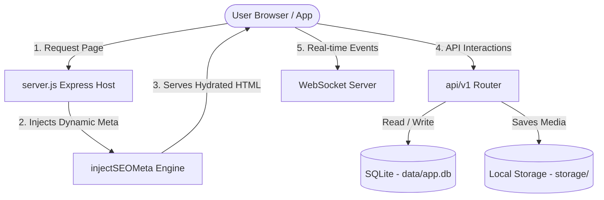
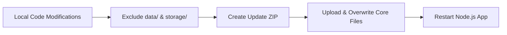

# YouBGram — High-Performance AI Social Media PWA 🚀

  
  
<strong>A modern, SEO-optimized, lightning-fast Progressive Web App (PWA) designed for developers and creators.</strong>

  
  
  
  
  

---

## ✨ Features

- 📱 **Native PWA Experience**: Features custom service workers, app manifests, caching, and install prompts tailored for iOS and Android.
- 🔍 **Dynamic Server-Side SEO**: Real-time server injection of meta tags based on database records to ensure crawler-friendly link sharing.
- 💬 **Real-time Communication**: Integrated lightweight WebSocket implementation (`ws`) for zero-delay user chatting and alerts.
- ⚡ **Optimized Asset Pipeline**: Automatically processes and compresses user-uploaded avatars and post media using `sharp` to minimize server storage and load times.
- 🛡️ **Two-Factor Admin Gateway**: Secure admin console with dedicated token signing secrets and automated database-level restrictions.

---

## 📐 Architecture Flow

The following diagram illustrates how **YouBGram** orchestrates frontend rendering, server routing, and database state:

---

## 📁 Repository Structure

### 🌐 Server & Core Files
| File / Directory | Purpose | Detail |
| :--- | :--- | :--- |
| 🚀 [server.js](file:///h:/My%20social%20media%20With%20flatter%20php2222/server.js) | Main Orchestrator | Handles static routing, PWA manifest, Sitemap generator, and Robots.txt serving. |
| ⚙️ [config.js](file:///h:/My%20social%20media%20With%20flatter%20php2222/config.js) | Config Hub | Single source of truth for app metadata, typography/themes, rate limits, and directory mappings. |
| 🗄️ [db/](file:///h:/My%20social%20media%20With%20flatter%20php2222/db) | Database Logic | SQLite database initializing scripts and query helper actions. |
| 🚦 [routes/](file:///h:/My%20social%20media%20With%20flatter%20php2222/routes) | Express API Map | Contains segregated endpoints for `auth`, `social`, and `admin` control. |
| 🧠 [controllers/](file:///h:/My%20social%20media%20With%20flatter%20php2222/controllers) | Controller Layer | Segregated functions managing business validation and logic. |
| 🔒 [middleware/](file:///h:/My%20social%20media%20With%20flatter%20php2222/middleware) | Route Guardrails | Verifies user-level and admin-level JWT claims and rate-limit scopes. |
| ⏳ [jobs/](file:///h:/My%20social%20media%20With%20flatter%20php2222/jobs) | Background Tasks | Cron processes to clean up outdated notifications and log files. |

### 🖥️ Client Workspace (`client/`)
| File / Directory | Purpose | Detail |
| :--- | :--- | :--- |
| 🎨 [client/src/App.jsx](file:///h:/My%20social%20media%20With%20flatter%20php2222/client/src/App.jsx) | Router & Auth Guards | Declares React Router boundaries, login state management, and protected pages. |
| 🪟 [client/src/components/](file:///h:/My%20social%20media%20With%20flatter%20php2222/client/src/components) | UI Components | Houses design building blocks like `PostCard`, `CommentSheet`, `Avatar`, and PWA utilities. |
| 📲 [client/public/sw.js](file:///h:/My%20social%20media%20With%20flatter%20php2222/client/public/sw.js) | Service Worker | Handles asset caching, fetch caching, offline fallbacks, and local push events. |

---

## 💾 Persistent Assets Care

> [!WARNING]
> The following directories contain user uploads and state data. **Never overwrite or delete these during updates.**

* 🗄️ **`data/`**
  * `app.db`: SQLite database file holding users, posts, chats, and system configuration.
* 🖼️ **`storage/`**
  * `avatars/`: Uploaded user profiles.
  * `posts/`: Uploaded image and video posts.
  * `ads/`: Stored admin advertisements.

---

## 🚀 Deployment & Updates

### 📥 First-Time Installation
1. **Prepare ZIP**: Compile project bundle (excluding `node_modules`).
2. **cPanel/VPS Upload**: Extract the ZIP file inside your targeted domain root (`public_html` or equivalent).
3. **Configure Environment**: Set up the local `.env` using `.env.example` as a guideline.
4. **NodeJS Server Creation**: Select the Node.js version (18 LTS recommended), specify `server.js` as the Application startup file, and click **Run NPM Install**.
5. **Start App**: Start the application inside your control panel interface.

### 🔄 Updating Without Data Loss
When deploying updates, always follow the **"Clean Update"** workflow to preserve user media and configuration databases:

> [!IMPORTANT]
> Because database structures are controlled by helper scripts inside [db/database.js](file:///h:/My%20social%20media%20With%20flatter%20php2222/db/database.js), any new columns or table definitions will safely auto-run and migrate on application restart.

---

## 🤖 Guidelines for AI Coding Assistants

1. **SEO Hydration**: Any new public endpoint serving views (like a post detail, profile view, or sharing page) MUST register inside the `injectSEOMeta` middleware function inside [server.js](file:///h:/My%20social%20media%20With%20flatter%20php2222/server.js).
2. **State Protection**: Use standard custom state stores (Zustand) located in `client/src/store/` to manage active authorization states, avoiding hardcoded flags.
3. **Media Pipeline**: Ensure any newly introduced picture or file upload handler routes uploads through `sharp` or custom compression before saving to the [storage/](file:///h:/My%20social%20media%20With%20flatter%20php2222/storage) folder.
